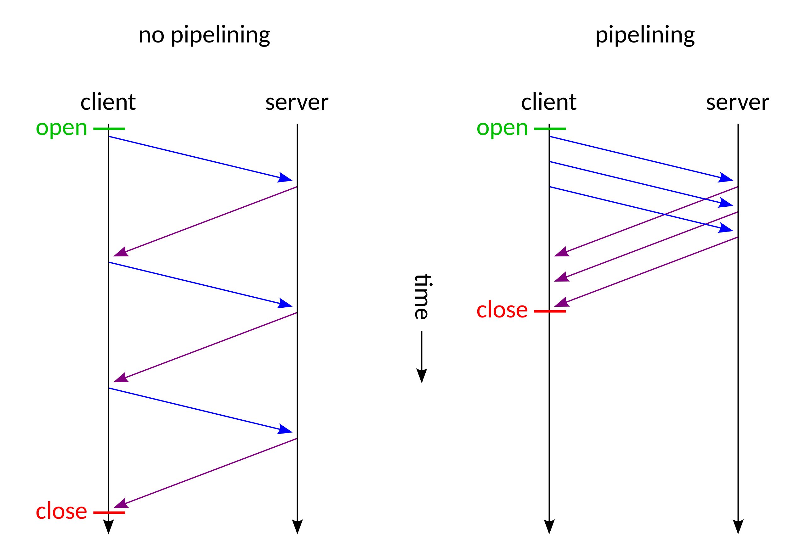

### Which HTTP protocol versions do you know?
- **HTTP/0.9** - (1991) Structured 'conversations' between client and server.
- **HTTP/1.0** - (1996) Support for headers, status codes, and more versatile content types.
- **HTTP/1.1** - (1999) A modern protocol version. *TCP* was added, allowing the connection (handshake) to stay open after the answer to the request was sent. This change allows for multiple requests during one connection.
- **HTTP/2.0** - New features: prioritizing of requests, support of server push messages, header compression, multiplexing of requests. 
- **HTTP/3.0** - *UDP* was added.

> Protocols are rules that govern how data is formatted and sent over a network.
> - **TCP (Transmission Control Protocol)** - is a connection-based protocol, more reliable and slower than UDP. TCP creates a secure communication line to ensure the reliable transmission of all data. Once a message is sent, the receipt is verified to make sure all the data was transferred. Best for: Email or texting, File transfers, Web browsing.
> - **UDP (User Datagram Protocol)** - is connectionless, less secure than TCP but faster. UDP does not establish a connection when sending data. It sends data without confirming receipt or checking for errors. That means some or all of the data may be lost during transmission. Best for: Online games, Live streaming, Video chatting.

`Imagine you’re having lunch at the office, and a friend in a different cubicle asks you for half of your sandwich. You have two options: You can walk through the maze of office desks and hand it to her, guaranteeing a secure delivery (TCP). Or, you can throw the sandwich into her cubicle from across the room, leaving the quality of the delivery up to her speed and reflexes (UDP).`
